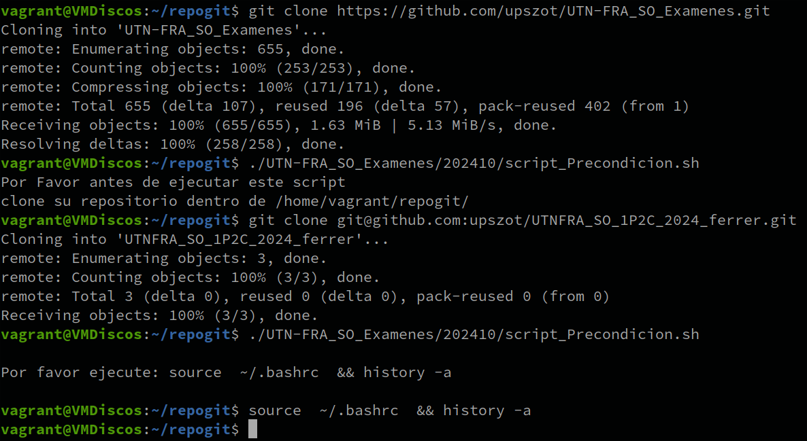
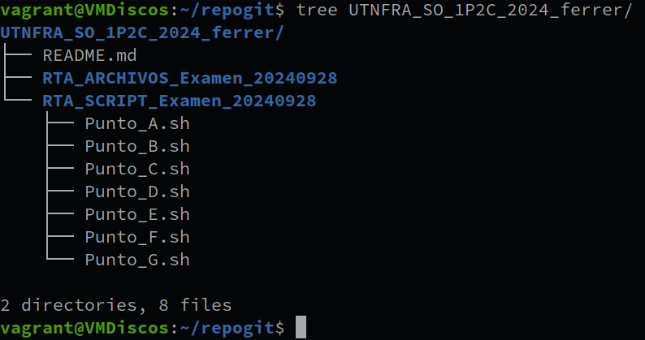

# UTN-FRA_SO_Examenes

## 1er Parcial Practico - 2do Cuatrimestre 2024

### Modo de Uso:

- Clonar el repositorio dentro del **`$HOME/repogit`** (con el Usuario que realizara el parcial)
```sh 
    mkdir repogit
    cd repogit
    git clone https://github.com/upszot/UTN-FRA_SO_Examenes.git
``` 

- Generar en github un repositorio **UTNFRA_SO_1P2C_2024_`Tu-Apellido`**
- Clonar el repositorio  **UTNFRA_SO_1P2C_2024_`Tu-Apellido`** dentro del **`$HOME/repogit`** (con el Usuario que realizara el parcial)
Ej:
```sh 
    cd repogit
    git clone git@github.com:upszot/UTNFRA_SO_1P2C_2024_ferrer.git
``` 
<div>
<table>
   <tr>
      <td></td>
   </tr>
</table>
</div>

- Ejecutar script de precondiciones:
```sh 
    cd $HOME/repogit
    ./UTN-FRA_SO_Examenes/202410/script_Precondicion.sh
    ~/.bashrc  && history -a  
``` 

El script de Precondiciones generara la estructura del necesaria para resolver el parcial dentro del repositorio del usuario.

<div>
<table>
   <tr>
      <td></td>
   </tr>
</table>
</div>
